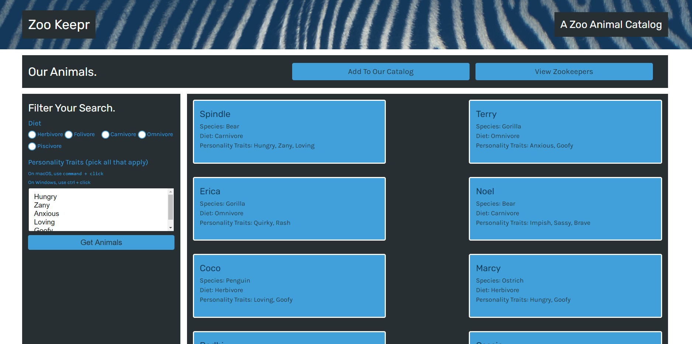

# Zookeepr

## Description:

This is a full stack application that uses the Model, View, Controller development paradigm to create a SQL database, and an implimented front end to interact with the database. 

# Table of Contents 

- [Deployment and Repository](#deployment/repository)
- [Usage](#usage)
- [Examples](#examples)
- [User Story](#userstory)
- [Acceptance Criteria](#AcceptanceCriteria)
- [Contributions](#contributing)
- [Tests](#tests)
- [License](#license)
- [Questions](#questions)
- [Technologies Used](#languages)

## Deployment/Repository: 
- [My Github Profile](https://github.com/suschuk24)

- [This Repository](https://github.com/suschuk24/zookeepr)

- [Deployed site via Heroku](https://tech-blog-106.herokuapp.com/) 

## Usage:

This was designed for users to be able to add animals and zookeepers to a database

## Examples

## License:
For more information about licenses, please visit:
[License](https://opensource.org/licenses/MIT)

## Contributing:

Seth Uschuk

## Tests:

Testing completed using InsomniaCore, Checked for typos and bugs

## Technologies Used:

* JavaScript
* Node
* Express
* mysql 2
* Sequelize
* HTML
* CSS

## Questions:

If you have any questions, please see my GitHub Page, or feel free to reach out by email:

-[GitHub's Guide to a Professional README](https://github.com/coding-boot-camp/potential-enigma/blob/master/readme-guide.md)

- [My Github Profile](https://github.com/suschuk24)

- [This Repository](https://github.com/suschuk24/zookeepr)

- [Deployed zsite via Heroku](https://tech-blog-106.herokuapp.com/) 

- [My Email](test@gmail.com)
